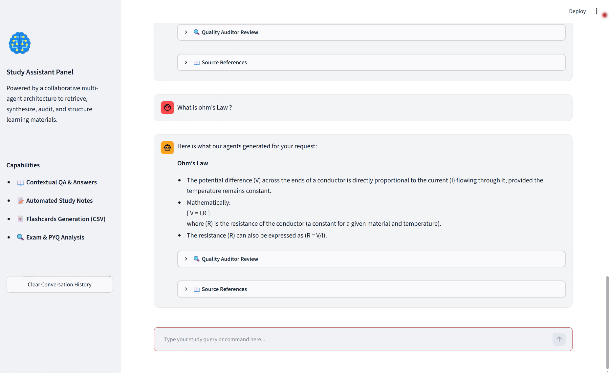
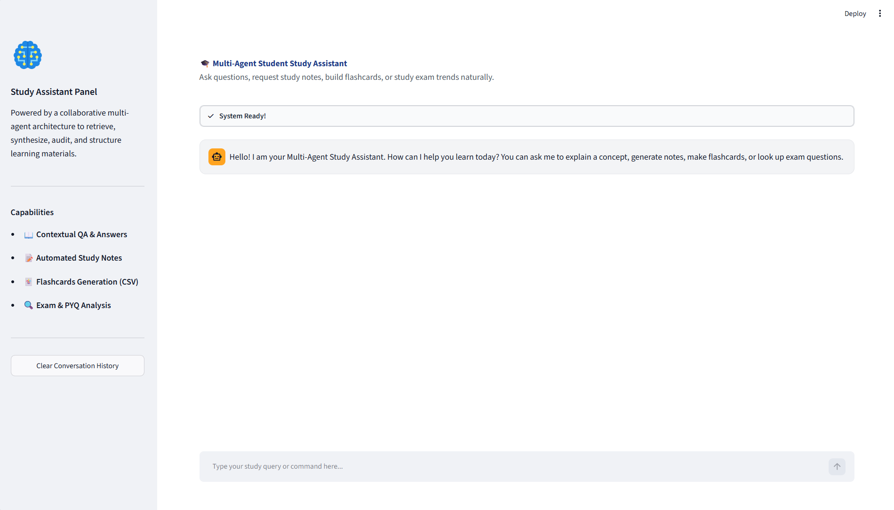
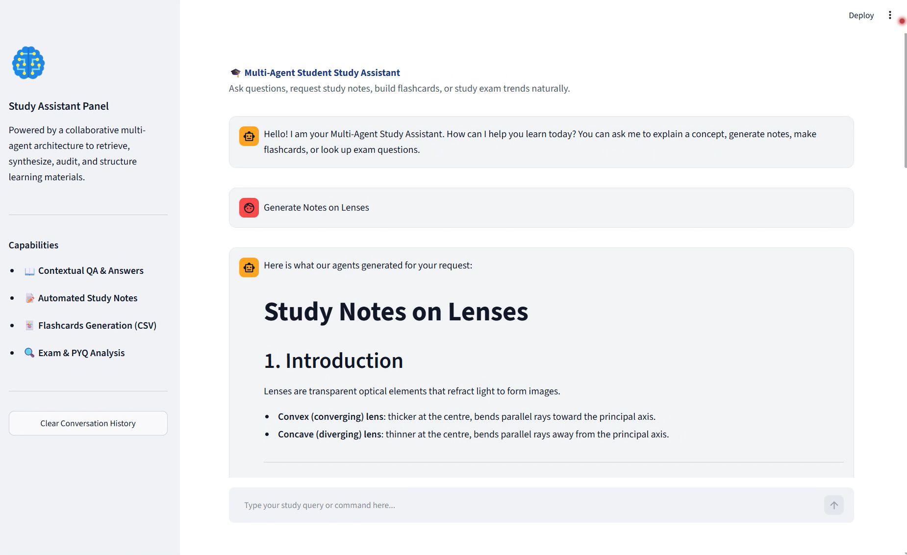
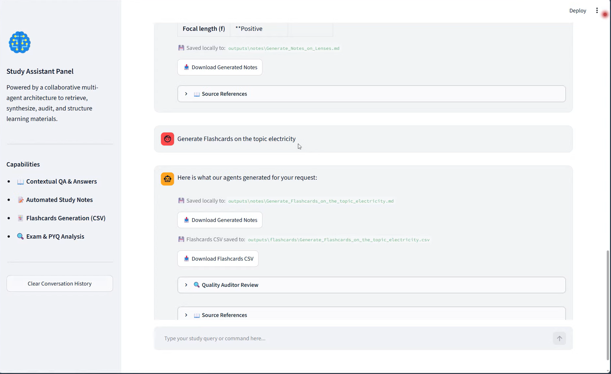
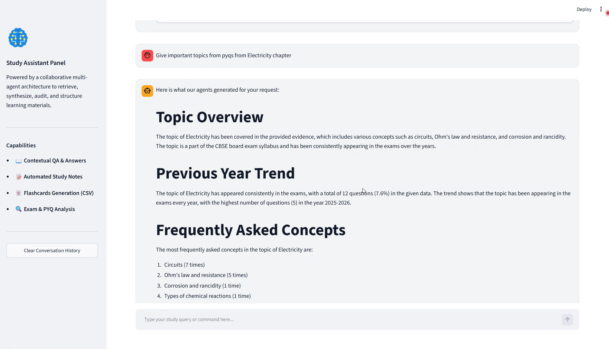
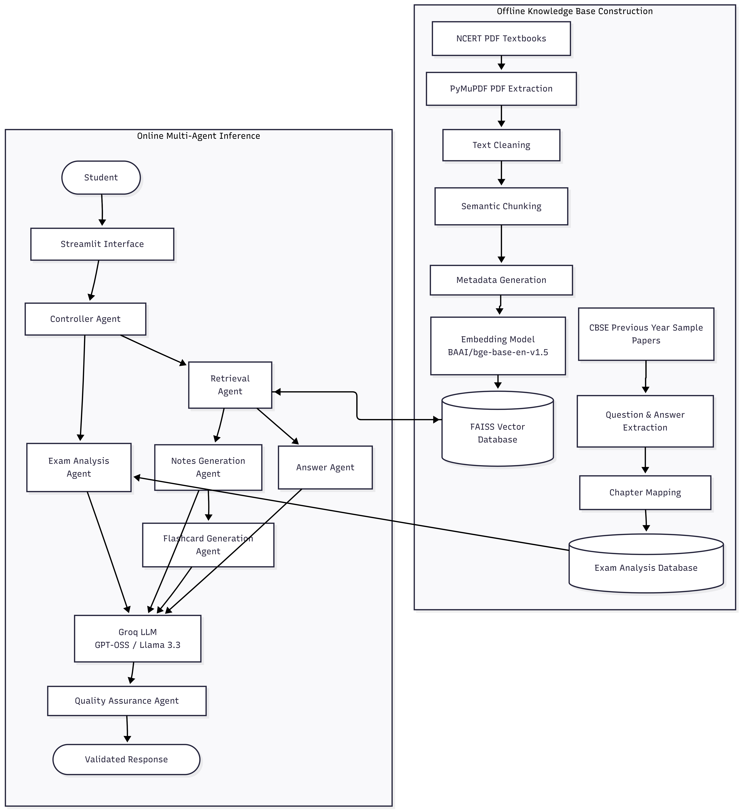

# 📚 Multi-Agent Student Study Assistant

> An AI-powered Multi-Agent Student Study Assistant that transforms NCERT textbooks into personalized learning resources using **Retrieval-Augmented Generation (RAG)**, **Large Language Models (LLMs)**, and a collaborative **Multi-Agent AI** architecture.


---

## 🚀 Live Demo

Try the application here:

🌐 **https://multi-agent-study-assistant.streamlit.app/**

---

# 📖 Overview

Studying from lengthy textbooks can be time-consuming and overwhelming. This project provides an intelligent study assistant that automatically converts textbook content into concise notes, flashcards, and exam-focused insights.

The system follows a **Retrieval-Augmented Generation (RAG)** pipeline powered by multiple specialized AI agents. Each agent performs a dedicated task—from extracting textbook content and retrieving relevant information to generating study material and validating output quality.

---

# 🎥 Demo Video

<p align="center">
  <a href="https://youtu.be/g4kpGhv0iao">
    
  </a>
</p>

<p align="center">
  <b>▶ Click the image above to watch the full demo on YouTube</b>
</p>

---

# 📷 Application Screenshots

| Home Page                               | Question Answering                    |
| --------------------------------------- | ------------------------------------- |
|  |  |

| Notes Generation                         | Flashcards Generation                        |
| ---------------------------------------- | -------------------------------------------- |
|  |  |

| Exam Analysis                                                          |
| ---------------------------------------------------------------------- |
| <p align="center"></p> |

---

# 🎯 Problem Statement

Students often spend significant time:
V

- Searching for relevant textbook content
- Creating revision notes
- Preparing flashcards
- Identifying important exam topics
- Understanding chapter weightage

This project automates these tasks using AI while ensuring that generated content remains grounded in the source textbooks through Retrieval-Augmented Generation (RAG).

---

# ✨ Features

- 📖 Extract text from NCERT PDF textbooks
- 🧩 Intelligent document chunking
- 🔍 Semantic search using FAISS Vector Database
- 🤖 Multi-Agent AI architecture
- 📝 Automatic chapter note generation
- 🎴 Flashcard generation
- 📊 Previous year exam analysis
- 📄 Markdown export
- 📁 CSV flashcard export
- ✅ AI Quality Auditing
- ⚡ Retrieval-Augmented Generation (RAG)
- 📚 Personalized study assistance

---

# 🏗️ System Architecture

<p align="center">
  
</p>

---

# 🤖 AI Agents

## 📄 1. PDF Agent

Responsible for processing textbook PDFs.

### Responsibilities

- Read PDF textbooks
- Extract text
- Preserve metadata
- Create document objects
- Prepare content for indexing

---

## 🔍 2. Retrieval Agent

Responsible for retrieving relevant knowledge.

### Responsibilities

- Convert user queries into embeddings
- Search the FAISS vector database
- Retrieve semantically similar chunks
- Supply context to downstream agents

---

## 📝 3. Notes Agent

Generates structured study notes.

### Responsibilities

- Chapter summaries
- Detailed notes
- Markdown formatting
- Mathematical equations using LaTeX

---

## 🎴 4. Flashcard Agent

Creates active recall learning material.

### Responsibilities

- Question-Answer generation
- Important fact extraction
- CSV export

---

## 📊 5. Exam Analysis Agent

Analyzes historical exam data.

### Responsibilities

- Analyze Previous Year Questions
- Identify recurring concepts
- Detect important chapters
- Estimate chapter weightage
- Discover exam trends

---

## ✅ 6. Quality Auditor Agent

Validates AI-generated content.

### Responsibilities

- Fact checking
- Hallucination detection
- Formatting validation
- Completeness verification
- Final quality assurance

---

# 🛠️ Technology Stack

| Category        | Technology            |
| --------------- | --------------------- |
| Language        | Python                |
| LLM Framework   | LangChain             |
| LLM             | Groq                  |
| Embedding Model | BAAI/bge-base-en-v1.5 |
| Vector Database | FAISS                 |
| PDF Processing  | PyMuPDF               |
| Output Formats  | Markdown, CSV         |

---

# 📂 Project Structure

```text
Multi-Agent-Student-Study-Assistant/
│
├── agents/
│   ├── exam_analysis_agent.py
│   ├── flashcard_agent.py
│   ├── notes_agent.py
│   ├── pdf_agent.py
│   ├── quality_auditor.py
│   └── retrieval_agent.py
│
├── modules/
│   ├── chunker.py
│   ├── csv_writer.py
│   ├── document_loader.py
│   ├── embedding_model.py
│   ├── exam_data.py
│   ├── llm_client.py
│   ├── markdown_writer.py
│   ├── pdf_loader.py
│   ├── retriever.py
│   ├── vector_store.py
│   └── __init__.py
│
├── data/
│   ├── books/
│   ├── vector_db/
│   └── previous_year_papers/
│
├── outputs/
│   ├── notes/
│   ├── flashcards/
│   └── exam_analysis/
│
├── app.py
├── web_app.py
├── config.py
├── requirements.txt
├── README.md
└── .gitignore
```

---

# 🚀 Installation

Clone the repository.

```bash
git clone https://github.com/yourusername/Multi-Agent-Student-Study-Assistant.git

cd Multi-Agent-Student-Study-Assistant
```

Create a virtual environment.

```bash
python -m venv venv
```

Activate it.

### Windows

```bash
venv\Scripts\activate
```

### Linux / macOS

```bash
source venv/bin/activate
```

Install dependencies.

```bash
pip install -r requirements.txt
```

Create a `.env` file.

```text
GROQ_API_KEY=your_api_key_here
```

---

# ▶️ Usage

Run the application.

```bash
python app.py
```

or

```bash
streamlit run web_app.py
```

---

# 📤 Generated Outputs

The system can generate:

- 📚 Chapter Notes
- 🎴 Flashcards
- 📊 Exam Trend Analysis
- 📄 Markdown Notes
- 📁 CSV Flashcards

---

# 📊 Workflow

1. Load NCERT textbook PDFs.
2. Extract text using the PDF Agent.
3. Split text into semantic chunks.
4. Generate embeddings.
5. Store embeddings in FAISS.
6. Receive user query.
7. Retrieve relevant chunks.
8. Generate personalized content using specialized AI agents.
9. Validate output with the Quality Auditor.
10. Export final study material.

---

# 📈 Evaluation

The generated outputs are evaluated by the Quality Assurance Agent using:

- Groundedness
- Completeness
- Coherence
- Conciseness

These metrics ensure that the generated study material remains factually accurate, context-aware, logically organized, and concise.

---

# 🎯 Applications

- Student self-learning
- Exam preparation
- Revision planning
- Personalized tutoring
- Digital education platforms
- AI-assisted learning

---

# 🚧 Future Enhancements

- 🌐 Multi-language support
- 🎤 Voice-based interaction
- 📱 Mobile application
- 🧠 Adaptive learning paths
- 📊 Student performance analytics
- 📝 Quiz generation
- 📷 OCR support for scanned textbooks
- ☁️ Cloud deployment
- 🎓 Support for additional educational boards

---

# 🤝 Contributing

Contributions are welcome!

1. Fork the repository.
2. Create a new feature branch.

```bash
git checkout -b feature-name
```

3. Commit your changes.

```bash
git commit -m "Add feature"
```

4. Push your branch.

```bash
git push origin feature-name
```

5. Open a Pull Request.

---

# 🙏 Acknowledgements

This project builds upon several outstanding open-source tools and research:

- LangChain
- FAISS
- PyTorch
- PyMuPDF
- Hugging Face
- Groq

---

# 👨‍💻 Author

**Lovish Mehra**

B.Tech Information Technology  
Maharaja Surajmal Institute of Technology (MSIT)

---

## ⭐ Support

If you found this project helpful, consider giving it a **⭐ Star** on GitHub. It helps others discover the project and supports future development.
